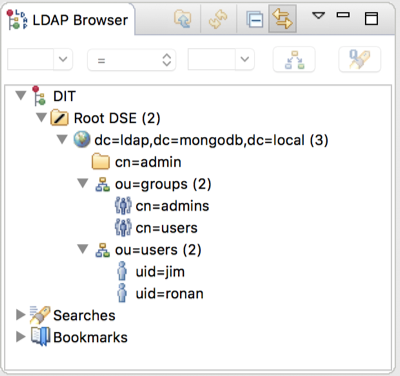
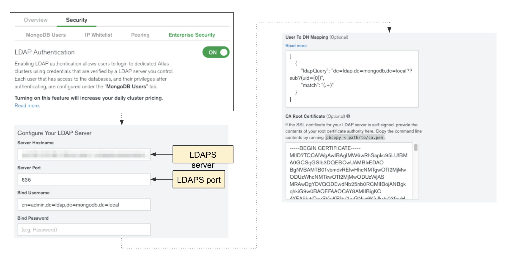
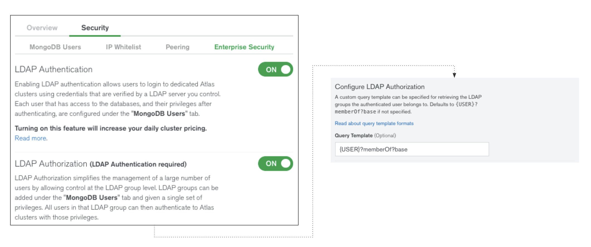
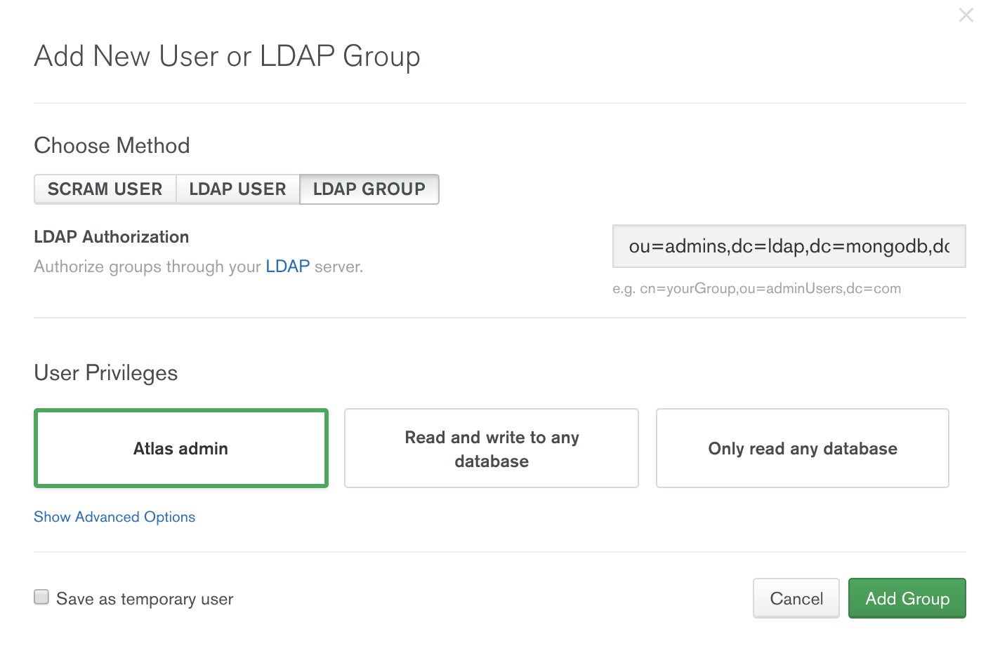
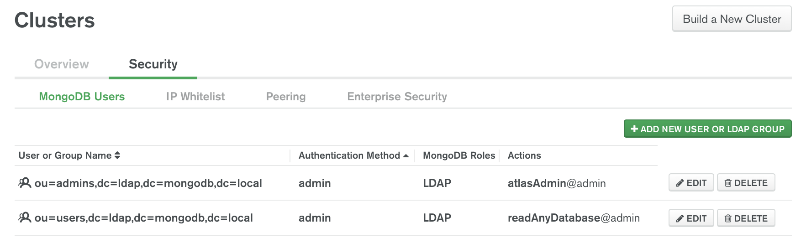

# MongoDB and OpenLDAP

This guide shows you how to install and configure OpenLDAP on Ubuntu 18.04 in order to use for Authentication & Autorization with MongoDB.

## Setup

### Create VM:

```
vagrant init ubuntu/bionic64
```

Edit Vagrant file to expose port 389 by:

* Forwarding port 3389 on the host to 389 on the guest.
* Creating a host-only or bridged network to allow the host communicate directly with the guest on port 389.

For the purposes of this demo we'll assume a host-only network accessible via `ldap.mongodb.local` (edit `/etc/hosts` to set this up if required)

### Start VM & connect:

```
vagrant up
vagrant ssh
```

## Install & Configure LDAP

### Update apt & install LDAP utils

```
sudo apt-get update
sudo apt install slapd ldap-utils ldapscripts
```

* Administrator password: `admin`
* Confirm password: `admin`

```
sudo dpkg-reconfigure slapd
```

* Omit OpenLDAP server configuration? `no`
* DNS domain name: `ldap.mongodb.local`
* Organization name: `mongodb`
* Administrator password: `admin`
* Confirm password: `admin`
* Database backend to use: `MDB`
* Do you want the database to be removed when slapd is purged? `no`
* Move old database? `yes`

This creates 2 DN's:

```
dn: dc=ldap,dc=mongodb,dc=local
dn: cn=admin,dc=ldap,dc=mongodb,dc=local
```

The first is the top level `organization` entity for our base DN `ldap.mongodb.local` while the second is an `organizationalRole` & `simpleSecurityObject` entity representing the the `admin` user.

This `admin` user can be used as the [`bind`](https://ldap.com/the-ldap-bind-operation/) user to update the directory if required.

Note: LDAPv3 supports anonymous simple authentication so you will be able to query the directory if you connect with no authentication.

Validate the configuration with the following command:

```
ldapsearch -H ldap:/// -x -b "dc=ldap,dc=mongodb,dc=local" -LLL dn
```

This command connects to the LDAP server running on localhost (`-H ldap:///`), uses simple authentication (`-x`), queries our base DN (`-b "dc=ldap,dc=mongodb,dc=local"`), outputs in LDIF format without comments or version (`-LLL`) and returns just the DN attributes (`dn`). We are using anonymous authentication because we haven't supplied a 'bind DN' (there is no `-D` option). The output should match the 2 DN's listed above.

### Install memberof overlay

This provides the reverse lookup capabilities such that for a `member` listed in a group, when you query the `memberOf` attribute on that member's DN you get the DN of the group back - exactly what we need to map users to roles in MongoDB!

Note: Other LDAP servers, as as Microsoft's ActiveDirectory, implement this functionaity natively.

```
cat <<EOF > memberof_load_configure.ldif
dn: cn=module{1},cn=config
cn: module{1}
objectClass: olcModuleList
olcModuleLoad: memberof
olcModulePath: /usr/lib/ldap

dn: olcOverlay={0}memberof,olcDatabase={1}mdb,cn=config
objectClass: olcConfig
objectClass: olcMemberOf
objectClass: olcOverlayConfig
objectClass: top
olcOverlay: memberof
olcMemberOfDangling: ignore
olcMemberOfRefInt: TRUE
olcMemberOfGroupOC: groupOfNames
olcMemberOfMemberAD: member
olcMemberOfMemberOfAD: memberOf
EOF

sudo ldapadd -Q -Y EXTERNAL -H ldapi:/// -f memberof_load_configure.ldif
```

```
cat <<EOF > refint1.ldif
dn: cn=module{1},cn=config
add: olcmoduleload
olcmoduleload: refint
EOF

sudo ldapmodify -Q -Y EXTERNAL -H ldapi:/// -f refint1.ldif
```

```
cat <<EOF > refint2.ldif
dn: olcOverlay={1}refint,olcDatabase={1}mdb,cn=config
objectClass: olcConfig
objectClass: olcOverlayConfig
objectClass: olcRefintConfig
objectClass: top
olcOverlay: {1}refint
olcRefintAttribute: memberof member manager owner
EOF

sudo ldapadd -Q -Y EXTERNAL -H ldapi:/// -f refint2.ldif
```

### Create users & groups

Connect to the LDAP server using, e.g., [ApacheDirectoryStudio](https://directory.apache.org/studio/) (from your client machine). Be sure to bind as the 'admin' user (`cn=admin,dc=ldap,dc=mongodb,dc=local`) using 'Simple Authentication' in order to be able to make modifications.

Under `dc=ldap,dc=mongodb,dc=local` create the following entries:

* `organizationalUnit` with a single RDN: `ou=users`
* `organizationalUnit` with a single RDN: `ou=groups`

Under the `ou=users` RDN create the following users:

  * `inetOrgPerson` with `uid=ronan`
  * `inetOrgPerson` with `uid=jim`

In both cases you will also need to fill in the `cn` (common name) and `sn` (surname). For the purposes of this demo, set the `cn` to be the same as the `uid` and set the `sn` for both users to any string you choose.

Under the `ou=groups` RDN create the following groups (manually or via the scripts below):

  * `groupOfNames`: `cn=admins` (add `uid=ronan` as a member)
  * `groupOfNames`: `cn=users` (add `uid=jim` and `uid=ronan` as members)

```
cat <<EOF > add-admins.ldif
dn: cn=admins,ou=groups,dc=ldap,dc=mongodb,dc=local
objectClass: groupofnames
cn: admins
description: All users
# add the group members all of which are
# assumed to exist under users
member: uid=ronan,ou=users,dc=ldap,dc=mongodb,dc=local
EOF

ldapadd -x -D cn=admin,dc=ldap,dc=mongodb,dc=local -W -f add-admins.ldif
```

```
cat <<EOF > add-users.ldif
dn: cn=users,ou=groups,dc=ldap,dc=mongodb,dc=local
objectClass: groupofnames
cn: users
description: All users
# add the group members all of which are
# assumed to exist under users
member: uid=jim,ou=users,dc=ldap,dc=mongodb,dc=local
member: uid=ronan,ou=users,dc=ldap,dc=mongodb,dc=local
EOF

ldapadd -x -D cn=admin,dc=ldap,dc=mongodb,dc=local -W -f add-users.ldif
```

This should result in the following setup:



### Set LDAP passwords

Run the following commands from the client (vagrant host) to set the password for both users:

```
ldappasswd -H ldap://ldap.mongodb.local:389 -S -W -D "cn=admin,dc=ldap,dc=mongodb,dc=local" -x "uid=ronan,ou=users,dc=ldap,dc=mongodb,dc=local"
```

```
ldappasswd -H ldap://ldap.mongodb.local:389 -S -W -D "cn=admin,dc=ldap,dc=mongodb,dc=local" -x "uid=jim,ou=users,dc=ldap,dc=mongodb,dc=local"
```

### Test membership

```
ldapsearch -x -LLL -H ldap://ldap.mongodb.local:389 -b uid=ronan,ou=users,dc=ldap,dc=mongodb,dc=local dn memberof
ldapsearch -x -LLL -H ldap://ldap.mongodb.local:389 -b uid=jim,ou=users,dc=ldap,dc=mongodb,dc=local dn memberof
```

Based on the `member` field in the `admins` group above, the first command should return two `memberOf` attributes:

```
dn: uid=ronan,ou=users,dc=ldap,dc=mongodb,dc=local
memberOf: cn=admins,ou=groups,dc=ldap,dc=mongodb,dc=local
memberOf: cn=users,ou=groups,dc=ldap,dc=mongodb,dc=local
```

The second command should return a single `memberOf` attribute:

```
dn: uid=jim,ou=users,dc=ldap,dc=mongodb,dc=local
memberOf: cn=users,ou=groups,dc=ldap,dc=mongodb,dc=local
```

## LDAP & MongoDB...

### Install MongoDB

Use the appropriate method (`apt-get`, `yum`, `m`, etc) to install MongoDB Enterprise Edition on your client machine.

### Create mongod.cfg file pointing to our new LDAP server

Create the following mongod.cfg file on your host machine:

```
cat <<EOF > mongod.cfg
storage:
  dbPath: /data/

processManagement:
  fork: true

systemLog:
  destination: file
  path: /data/mongodb.log

net:
  port: 27017
  bindIp: 0.0.0.0

security:
#   authorization: "enabled"
   ldap:
      transportSecurity: none
      servers: "ldap.mongodb.local:389"
      bind:
         queryUser: "cn=admin,dc=ldap,dc=mongodb,dc=local"
         queryPassword: "admin"
      userToDNMapping:
         '[
            {
               match : "(.+)",
               ldapQuery: "dc=ldap,dc=mongodb,dc=local??sub?(uid={0})"
            }
         ]'
      authz:
         queryTemplate: "{USER}?memberOf?base"
setParameter:
   authenticationMechanisms: "PLAIN"
EOF
```

This defines a fairly standard confuration but with LDAP enabled. Focusing on the `security` section:

* We are not enabling authorization at this point (can be enabled later if required).
* We have disabled transport encryption meaning that all network communication occurs in plaintext (for production scenarios you would remove the `transportSecurity: none` setting, which would enable transport security).
* We have specified the FQDN of our LDAP server (including port).
* We are binding with the `admin` user.
* We have specified a single `userToDNMapping` rule which takes any input and converts it into a sub-tree LDAP query, looking for users with that string as their `uid`.
* We've specified a base LDAP query as the authorization template, taking the DN we matched via the `userToDNMapping` query and retrieving the `memberOf` attribute.
* We are using the `PLAIN` authentication mechanism, which is how we tell the system we're using an LDAP server for authentication purposes.

### Test using `mongoldap`

`mongoldap` is a command line tool supplied with MongoDB Enterprise which can validate the mongod configuration file without requiring you to start/restart a `mongod` process.

Test our configuration file using the two users we have defined. Note that we use a simple value for each user which will be mapped to a DN based on the `userToDNMapping` rules.

```
mongoldap --config mongod.cfg --user ronan
mongoldap --config mongod.cfg --user jim
```

Ignore any FAIL's relating to binding with a plaintext password over a non-TLS connection (setting up an LDAPS server is left as an exercise for the reader...)

The first command returns the following role:

```
* cn=admins,ou=groups,dc=ldap,dc=mongodb,dc=local
```

The second command returns the following role:

```
* cn=users,ou=groups,dc=ldap,dc=mongodb,dc=local
```

### Start MongoDB & Connect

Start the `mongod` process (make sure you are using the Enterprise version!):

```
mongod -f mongod.cfg
```

Check the log file (`/data/mongodb.log`) for a successful start. In particular look for the `initandlisten` line specifying the `options`, making sure they match the options in the configuration file. Also check for a subsequent `initandlisten` line containing the following text:

```
Server configured with LDAP Authorization. Spawned $external user cache invalidator.
```

Once the server is running you can connect via the mongo shell (we don't have authorization enabled at this point so we can just connect):

```
mongo
```

### Create admin & readonly roles

In order to allow users defined in our LDAP server to connect to the database we have to create `roles` in the database with associated privileges. We do *not* have to create any users directly. Instead the roles defined in the database map to the groups in our LDAP server and users which are members of these groups will be granted the privileges defined by the associated MongoDB role.

We will create 2 roles:

1. For the `cn=admins` group, giving those users full root permission.
2. For the `cn=users` group, giving those users read-only permission on a single collection (`reporting.webstats`).

```
use admin
db.createRole({role: "cn=admins,ou=groups,dc=ldap,dc=mongodb,dc=local", privileges:[], roles: ["root"]})
db.createRole({role: "cn=users,ou=groups,dc=ldap,dc=mongodb,dc=local", privileges: [{ resource: { db: "reporting", collection: "webstats" }, actions: [ "find" ] }], roles: []})
```

In this example any member of the `cn=admins` group will be a MongoDB root user, while any member of the `cn=users` group will only have read access (`find`) to the `reporting.webstats` namespace.

### Test new roles

```
use $external

db.auth({mechanism: "PLAIN", user: "ronan", pwd:"ronan"})
db.runCommand({connectionStatus:1})

db.auth({mechanism: "PLAIN", user: "jim", pwd:"jim"})
db.runCommand({connectionStatus:1})
```

(replace passwords, i.e., `pwd` fields, with the ones you defined earlier if different)

The `db.auth()` command in both cases should succeed (returning `1`). Only the first `connectionStatus` will contain the `root@admin` role:

```
{
	"authInfo" : {
		...
		"authenticatedUserRoles" : [
			{
				"role" : "root",
				"db" : "admin"
			},
		...
	}
}
```

## TLS

### Install GNU TLS binaries & SSL Cert packages

Install the various packages on the guest as follows:

```
sudo apt install gnutls-bin ssl-cert
```

### Generate CA & self-signed Certificate for LDAPS server

We're going to use our own CA and self-signed certs for this demo...

#### Create Certificate Authority

```
sudo sh -c "certtool --generate-privkey > /etc/ssl/private/cakey.pem"

sudo sh -c "cat > /etc/ssl/ca.info" <<EOF
cn = MongoDB
ca
cert_signing_key
EOF

sudo certtool --generate-self-signed --load-privkey /etc/ssl/private/cakey.pem --template /etc/ssl/ca.info --outfile /etc/ssl/certs/cacert.pem
```

#### Update the Hostname (if required)

The simplest way to get all of this TLS stuff to work is to make sure the hostname of the LDAP server matches the full external hostname of the server itself (the FQDN). This is particularly important with AWS instances, for example.

If you need to update the hostname run a command similar to the following (substituting in the FQDN):

```
sudo hostnamectl set-hostname ec2-ww-xx-yy-zz.abc.compute.amazonaws.com
```

After this you'll need to restart the LDAP server:

```
sudo systemctl restart slapd.service
```

#### Create Server Certificate

**IMPORTANT**: Replace `cn` value with the FQDN for the LDAP server, especially if you want to connect from Atlas, for example, where you may have less control over DNS settings!

```
sudo certtool --generate-privkey --bits 1024 --outfile /etc/ssl/private/mongodb_slapd_key.pem

# MUST use public hostname of LDAP server for cn!!
sudo sh -c "cat > /etc/ssl/mongodb.info" <<EOF
organization = MongoDB
cn = ec2-ww-xx-yy-zz.abc.compute.amazonaws.com
tls_www_server
encryption_key
signing_key
expiration_days = 3650
EOF

sudo certtool --generate-certificate --load-privkey /etc/ssl/private/mongodb_slapd_key.pem --load-ca-certificate /etc/ssl/certs/cacert.pem --load-ca-privkey /etc/ssl/private/cakey.pem --template /etc/ssl/mongodb.info --outfile /etc/ssl/certs/mongodb_slapd_cert.pem
```

#### Update file ownership, permissions & group membership

```
sudo chgrp openldap /etc/ssl/private/mongodb_slapd_key.pem
sudo chmod 0640 /etc/ssl/private/mongodb_slapd_key.pem
sudo gpasswd -a openldap ssl-cert
```

### Update LDAP Config

```
cat <<EOF > certinfo.ldif
dn: cn=config
add: olcTLSCACertificateFile
olcTLSCACertificateFile: /etc/ssl/certs/cacert.pem
-
add: olcTLSCertificateFile
olcTLSCertificateFile: /etc/ssl/certs/mongodb_slapd_cert.pem
-
add: olcTLSCertificateKeyFile
olcTLSCertificateKeyFile: /etc/ssl/private/mongodb_slapd_key.pem
EOF

sudo ldapmodify -Y EXTERNAL -H ldapi:/// -f certinfo.ldif
```


*Aside*:

If you need to update the certs at a later time, replace the file contents as follows (adding the `changetype` field and changing all the `add` fields to `replace`) before executing the `ldapmodify` command:

```
cat <<EOF > certinfo-modify.ldif
dn: cn=config
changetype: modify
replace: olcTLSCACertificateFile
olcTLSCACertificateFile: /etc/ssl/certs/cacert.pem
-
replace: olcTLSCertificateFile
olcTLSCertificateFile: /etc/ssl/certs/mongodb_slapd_cert.pem
-
replace: olcTLSCertificateKeyFile
olcTLSCertificateKeyFile: /etc/ssl/private/mongodb_slapd_key.pem
EOF

sudo ldapmodify -Y EXTERNAL -H ldapi:/// -f certinfo-modify.ldif
```

### Add 'ldaps' as a valid endpoint

MongoDB support LDAPS, not StartTLS over a standard LDAP connection, so the `SLAPD_SERVICES` string in the `slapd` config file needs to include `ldaps:///`, e.g.

```
sudo vi /etc/default/slapd
```

Then replace this line:

```
SLAPD_SERVICES="ldap:/// ldapi:///"
```

with this line:

```
SLAPD_SERVICES="ldap:/// ldaps:/// ldapi:///"
```

### Restart Service (again)

```
sudo systemctl restart slapd.service
```

### Validate

Check we have some basic connectivity by using an OpenSSL command line tool from the client machine:

```
openssl s_client -connect ldap.mongodb.local:636 -showcerts -state -CAfile /etc/ssl/certs/mongodb_slapd_cert.pem
```

And now with `ldapsearch`, noting the user of the `ldaps` URI scheme and that we're connecting to port 636:

```
ldapsearch -H ldaps://ldap.mongodb.local:636 -x -b "dc=ldap,dc=mongodb,dc=local" -LLL
```

Note: You may need to add this to your `.ldaprc` file for the TLS handshake to work. (I need to do this on my Mac for example. If anyone knows why exactly I'd be very interested to hear!)

```
cat <<EOF > ~/.ldaprc
TLS_CACERT      /etc/ssl/certs/mongodb_slapd_cert.pem
EOF
```

## MongoDB Atlas

### Set up firewall rules

Add `0.0.0.0/0` to the firewall rules on the LDAP server to allow MongoDB Atlas (and the MongoDB clusters) to connect.

### Enable LDAP Authentication & Authorization in Atlas

Navigate to the relevant MongoDB Atlas Project, then select the `Security` tab, followed by the `Enterprise Security` tab.

Enable the `LDAP Authentication` and `LDAP Authorization` options via the rocker.

Fill out the following entries (based on the configuration we created above):

**Configure Your LDAP Server**



`Server Hostname`: _FQDN of remote LDAPS server_

`Server Port`: `636`

`Bind Username`: `cn=admin,dc=ldap,dc=mongodb,dc=local`

`Bind Password`: `admin` _(Bind Username's password)_

`User To DN Mapping`: `[{ match : "(.+)", ldapQuery: "dc=ldap,dc=mongodb,dc=local??sub?(uid={0})" }]`

`CA Root Certificate`: _Contents of the CA file, e.g. `/etc/ssl/certs/cacert.pem`_

**Configure LDAP Authorization**



`Query Template`: `{USER}?memberOf?base`

**Validate and Save**

Once all the values are set click the 'Validate and Save' button at the bottom of the screen. All going well MongoDB Atlas should process the values and after a short pause (as it connects to the LDAP server) it should indicate a successful configuration change.

### Create LDAP Roles in Atlas



Switch to the `MongoDB Users` tab within the `Security` tab for your LDAP enabled project.

To add a new LDAP group, click the `Add New User or LDAP Group` button on the top right and select the `LDAP Group` method.

In the `LDAP Authorization` field enter the full DN of the respective LDAP group, e.g. `ou=admins,dc=ldap,dc=mongodb,dc=local`

Select the `User Privileges` as normal for any members of this LDAP group, e.g. `Atlas admin` or choose advanced options by clicking the `Show Advanced Options` and filling out the relevant details.

The result should look something like the following:



Verify this configuration by connecting to your Atlas cluster as a user who is a member of one of the defined LDAP groups, e.g. as the user `ronan` (which will get mapped to the DN `uid=ronan,ou=users,dc=ldap,dc=mongodb,dc=local`). The groups this user is a member of (a result of running the `ldapQuery` template) define which roles that user has in the Atlas cluster based on the `LDAP Group` mappings defined above.

## Acknowledgements & References

### MongoDB Documentation References

* [LDAP Proxy Authentication](https://docs.mongodb.com/manual/core/security-ldap/)
* [LDAP Authorization](https://docs.mongodb.com/manual/core/security-ldap-external/)
* [Configuration File Options for LDAP](https://docs.mongodb.com/manual/reference/configuration-options/#security-ldap-options)
* [mongoldap](https://docs.mongodb.com/manual/reference/program/mongoldap/)

### MongoDB Atlas Documentation References

* [Set up User Authentication and Authorization with LDAP](https://docs.atlas.mongodb.com/security-ldaps/)

### MongoDB Blog posts

* [How to Configure LDAP Authentication for MongoDB](https://www.mongodb.com/blog/post/how-to-configure-LDAP-authentication-for-mongodb)

### External Guides

* [OpenLDAP setup](https://technicalnotes.wordpress.com/2014/04/19/openldap-setup-with-memberof-overlay/) (with some minor changes, e.g. changing `HDB` to `MDB` for the `olcDatabase`)
* [TLS setup](https://help.ubuntu.com/lts/serverguide/openldap-server.html) (see the 'TLS' section)
